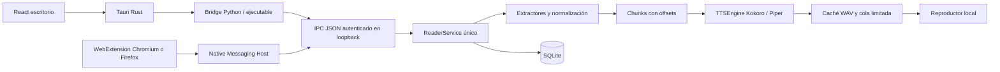
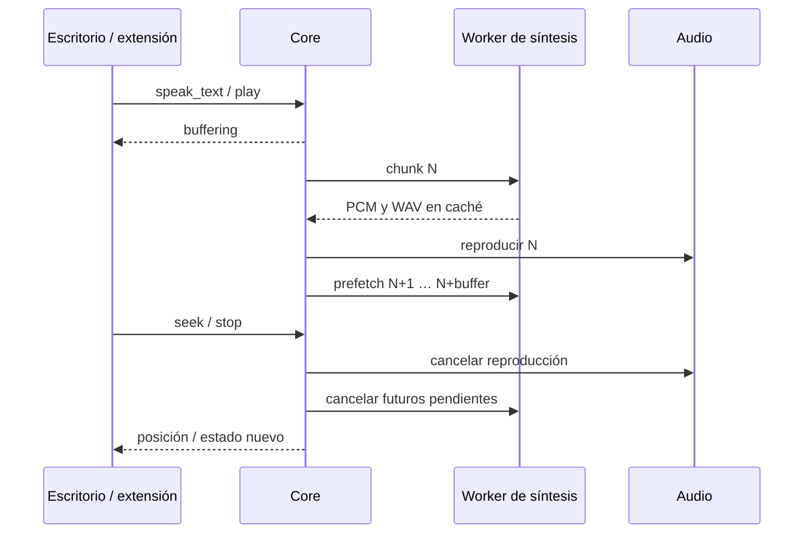

# Arquitectura

El core es un proceso Python independiente. Una sola instancia mantiene documento, modelo, reproductor, preferencias y progreso por usuario/directorio de datos. El escritorio y los hosts de cada navegador son clientes del mismo proceso. Cerrar un cliente no detiene la lectura del otro.

## Responsabilidades

- `core/reader_core/protocol`: versión, validación y framing de mensajes; rechaza campos/comandos desconocidos.
- `extractors`: rutas locales permitidas únicamente al escritorio; estrategia por formato, límites de expansión ZIP y OCR local.
- `text_processing`: Unicode, limpieza conservadora, frases y chunks; nunca corta palabras, mantiene offsets sobre texto normalizado.
- `documents`: modelo común y paginación; el texto completo no se envía en cada evento.
- `tts`: interfaz independiente; carga de modelos solo locales, fallback CPU y errores comprensibles.
- `audio`: caché LRU persistente, síntesis anticipada con un worker, cancelación por generación y salida centralizada.
- `persistence`: SQLite con acceso serializado; preferencias y progreso por hash de contenido.
- `service`: única API de comandos; las UIs no importan clases Python.
- `ipc`: descubrimiento local, lock de instancia entre procesos, autenticación y arranque sin GUI.
- `native`: framing del navegador y eventos de estado; no permite abrir rutas locales.
- `packages/types` y `packages/ui`: tipos y controles React compartidos.

## Concurrencia

Una generación invalida resultados de una lectura anterior. Una inferencia ONNX ya ejecutándose no se puede interrumpir dentro de C: se descarta el resultado y se cancelan los futuros posteriores. El nuevo destino tiene prioridad cuando termina esa inferencia corta. El máximo de texto por chunk limita el trabajo pendiente. El audio y sus controles tienen estado único; el navegador no reproduce audio propio.

La extracción/OCR vive en threads de conexión y no bloquea la UI. Las operaciones de carga se serializan para evitar sustituir documentos a mitad de una actualización. La UI usa polling de estado y el host Native Messaging emite eventos cuando cambia la revisión o durante reproducción. El bus conserva los últimos 50 eventos locales; no es un sistema distribuido ni una cola remota.

## Persistencia

`reader.sqlite3` guarda preferencias y progreso. El ID de documento es SHA-256 del texto normalizado. El audio usa hash de texto, motor/versión, archivos de modelo, voz, idioma, velocidad, versión de normalización y diccionario. Las fechas de acceso de WAV permiten limpieza LRU. La cuota se aplica al escribir; vaciar caché no afecta el audio que ya está en memoria.

El progreso guarda chunk, párrafo, sección, ruta, segundos, voz, idioma, velocidad y finalización; las preferencias globales prevalecen al reabrir. La continuación exacta requiere la misma voz y velocidad. No se persisten los párrafos completos ni el contenido del navegador en SQLite.
